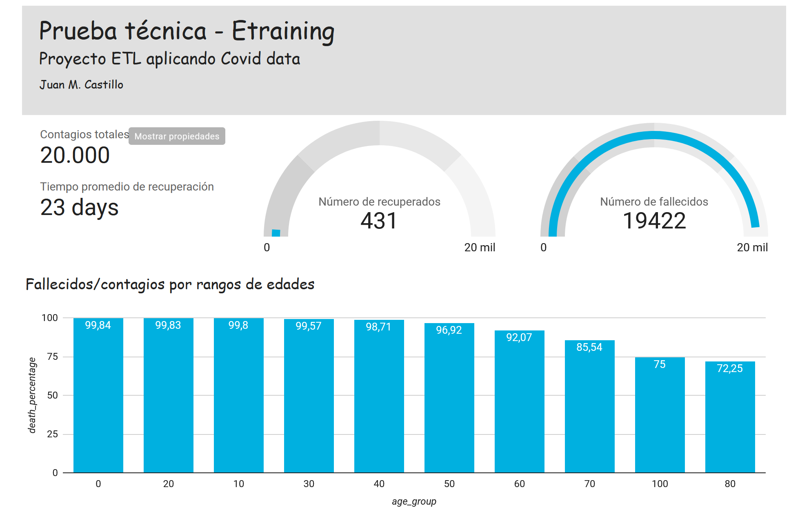

# Proyecto ETL - Prueba técnica Etraining

Este proyecto realiza un pipeline ETL para datos de COVID-19 desde un archivo Excel hacia bases de datos SQLite y BigQuery. También realiza transformaciones necesarias para cálculos de indicadores clave (KPIs). Esta aplicación utiliza Docker para facilitar la configuración CRON (Dataflow) y la ejecución del entorno. La aplicación está diseñada para ejecutarse con Python 3.11.

## Requisitos

- Docker
- Docker Compose

## Instalación

1. Clonar el repositorio:
   ```bash
   git clone https://github.com/J-CastilloS/etraining_prueba_tecnica.git
   cd etraining_prueba_tecnica
   ```

2. Inicializar gcloud (jcastillos1):
- Dado que se utilizan servidores de nube, se debe inicializar sesión con [GCloud CLI](https://cloud.google.com/sdk/docs/install?hl=es-419#windows)

## Uso
Construir y lanzar los contenedores de Docker:
   ```bash
   docker build -t my_cron_app . 
   docker run -d --init my_cron_app
   ```
En caso de que sólo se quiera ver el proceso en back: 
   ```bash
   python src/main.py
   ```

## Esquemas

- `db/schema_cloud.sql`: Contiene el esquema de la base de datos para BigQuery, con tablas `department`, `municipality`, `gender`, `status`, `type_contagion` y `cases`.
- `db/schema_local.sql`: Contiene el esquema de la base de datos para SQLite, con estructuras similares al esquema de BigQuery.

## Tablero

Puedes visualizar y analizar los datos generados por esta aplicación en nuestro tablero de Looker Studio. Haz clic en el siguiente enlace para acceder: [Ver Tablero de Looker Studio](https://lookerstudio.google.com/reporting/52dc6bf3-e8cc-41bc-9472-4ca41d7dfd99).

## Notas adicionales

- El script `main.py` lee todas las pestañas del archivo Excel y las carga en ambas bases de datos (SQLite y BigQuery).
- Las transformaciones y cálculos de KPIs se realizan en el script para preparar los datos destinados a visualizaciones en Looker.